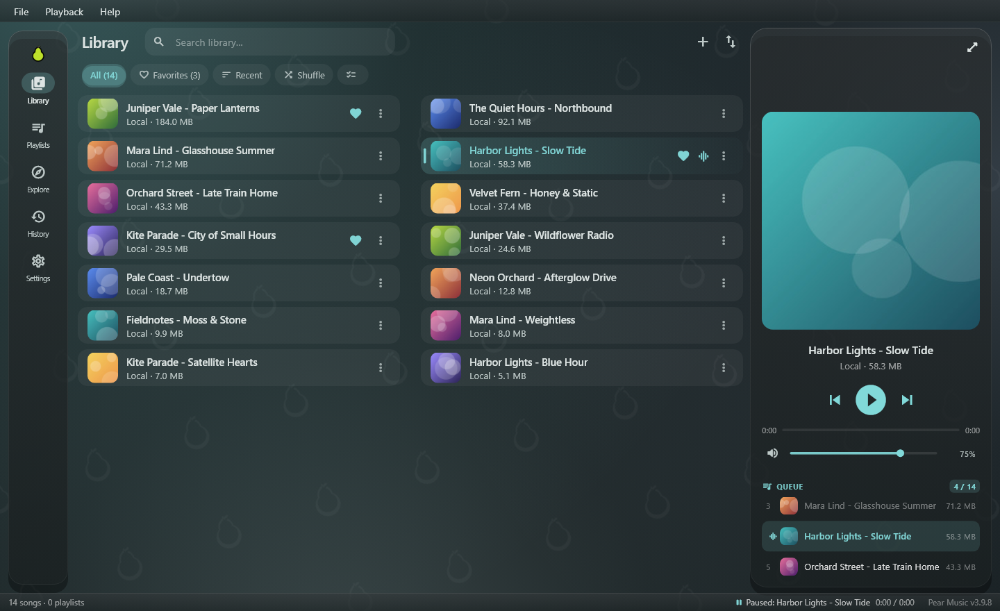
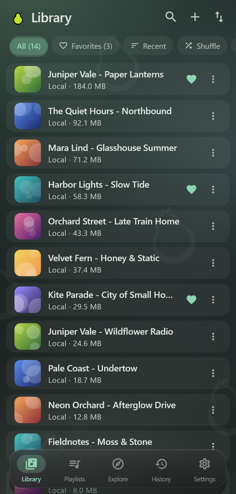

<div align="center">


# Pear Music

**A music player for your own files, with streaming search built in.**<br>
Windows and Android. No account, no cloud, no ads.

[](https://github.com/Boci0/Pear-Music/releases/latest)
[](https://github.com/Boci0/Pear-Music/releases)
[](LICENSE)
[](https://flutter.dev)

<br>

[](https://github.com/Boci0/Pear-Music/releases/latest/download/PearMusic-Windows-Setup.exe)
&nbsp;
[](https://github.com/Boci0/Pear-Music/releases/latest/download/PearMusic-Android-arm64.apk)

[Features](#features) &nbsp;·&nbsp; [Download](#download) &nbsp;·&nbsp; [Android tips](#android-tips) &nbsp;·&nbsp; [Build from source](#build-from-source)

<br>


&nbsp;


</div>

<br>

## Features

<table>
<tr>
<td width="50%" valign="top">

### Play your music

- Plays the audio files already on your device, even with no internet
- Full-size artwork with background colours taken from the cover
- Waveform seek bar and an optional visualizer
- Sleep timer: end of song, countdown, or end of queue
- Speed from 0.5x to 2x, plus volume levelling between songs

</td>
<td width="50%" valign="top">

### Find new songs

- Search and stream songs straight from the app
- Genre pills on the Explore tab for quick browsing
- **Endless Play** keeps adding related songs when your queue runs out
- The next song downloads ahead of time, so skipping is instant
- Save any streamed song to your library with one tap

</td>
</tr>
<tr>
<td width="50%" valign="top">

### Keep it organised

- Playlists, favourites, and a History tab of everything you played
- Pull-up queue: drag to reorder or remove songs
- **Import & export**: back up your whole library and bring it to another device
- Import several M3U8 playlists at once, with progress and Cancel
- Clearing your history never touches your library

</td>
<td width="50%" valign="top">

### Sing along

- Lyrics that follow the song line by line
- Uses your own `.lrc` files first, then looks them up online
- Colour options that stay readable on busy artwork
- Timing sheet to fix lyrics that run early or late

</td>
</tr>
<tr>
<td width="50%" valign="top">

### Works like a real app

- Lock screen and notification controls on Android
- Windows media overlay and keyboard media keys on desktop
- Updates itself from the app; Android resumes a broken download and checks the file before installing
- Reduced Effects mode to save battery

</td>
<td width="50%" valign="top">

### Stays yours

- No sign-up and nothing stored online
- Your songs, playlists and history live on your device
- Free and open source under the MIT licence

</td>
</tr>
</table>

## Download

Grab the latest build below, or browse every file on the [releases page](https://github.com/Boci0/Pear-Music/releases/latest).

| Platform | File | Best for |
| :--- | :--- | :--- |
| **Windows 10 / 11** | [**Setup installer**](https://github.com/Boci0/Pear-Music/releases/latest/download/PearMusic-Windows-Setup.exe) | Most people. No admin rights needed, adds Start Menu shortcuts and an uninstaller. |
| **Windows 10 / 11** | [Portable ZIP](https://github.com/Boci0/Pear-Music/releases/latest/download/PearMusic-Windows-x64.zip) | Running from a folder without installing. |
| **Android** | [**ARM64 APK**](https://github.com/Boci0/Pear-Music/releases/latest/download/PearMusic-Android-arm64.apk) | Almost any phone from the last ten years. |
| **Android** | [ARMv7 APK](https://github.com/Boci0/Pear-Music/releases/latest/download/PearMusic-Android-armv7.apk) | Older 32-bit phones only. |

You only pick once. After that, in-app updates fetch the right file for your device on their own.

<details>
<summary><b>Check that your download is genuine</b></summary>
<br>

Compare the file against [`SHA256SUMS`](https://github.com/Boci0/Pear-Music/releases/latest/download/SHA256SUMS):

```powershell
# Windows (PowerShell)
Get-FileHash .\PearMusic-Windows-Setup.exe -Algorithm SHA256
```

```bash
# Linux / macOS
sha256sum PearMusic-Android-arm64.apk
```

</details>

## Android tips

Some phones stop music in the background to save battery. If playback pauses on its own or the controls vanish, check these:

1. **Allow notifications.** On Android 13 and newer, accept the prompt on first launch so the player controls can show on the lock screen and in the notification shade.
2. **Turn off battery limits for Pear Music.**
   - Vivo / iQOO: **Settings > Battery > Background power consumption management > Pear Music > Allow high background power consumption**
   - Samsung, Pixel, Xiaomi: **App info > Battery > Unrestricted**
3. **Pin the media player** (optional). To keep it in Quick Settings while paused, turn on **Settings > Sound & vibration > Media > Pin media player** where your phone offers it.

## Build from source

<details>
<summary><b>Requirements</b></summary>
<br>

- Flutter stable **3.44.9** (Dart 3.12.2 or newer), the same version the release builds use
- **Windows:** Visual Studio 2022 with the *Desktop development with C++* workload
- **Android:** Android SDK with compile SDK 37, and Java 17 or newer

</details>

```bash
git clone https://github.com/Boci0/Pear-Music.git
cd Pear-Music/app
flutter pub get

flutter run -d windows     # or: flutter run -d android
flutter test
```

<details>
<summary><b>Release builds</b></summary>
<br>

```bash
# Android, one APK per CPU type (arm64-v8a, armeabi-v7a, x86_64)
flutter build apk --split-per-abi --release

# Windows x64
flutter build windows --release
```

Official releases include the arm64-v8a and armeabi-v7a APKs. The x86_64 one is only useful for emulators.

</details>

## Feedback

Found a bug or want something added? [Open an issue](https://github.com/Boci0/Pear-Music/issues).

<br>

<div align="center">
<sub>MIT licence &nbsp;·&nbsp; Copyright (c) 2026 Boci0</sub>
</div>
